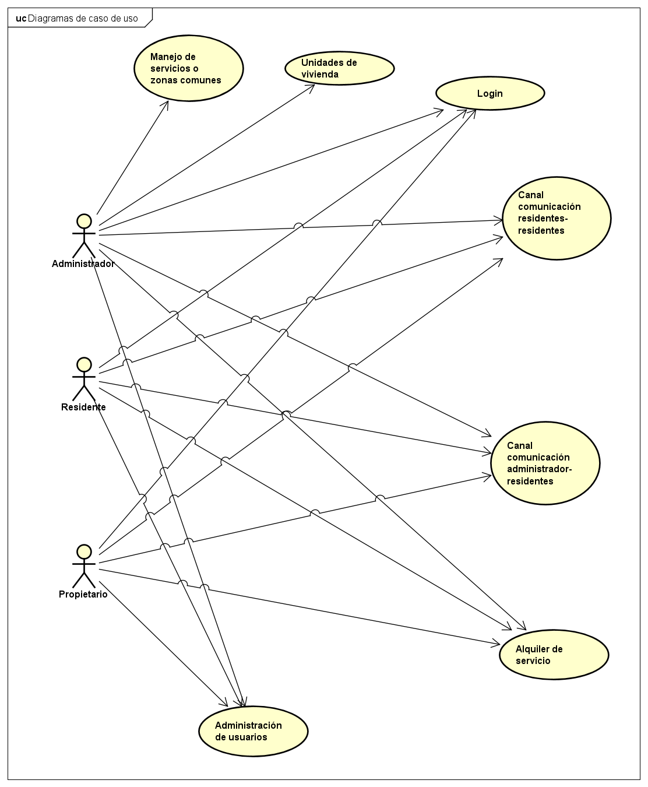
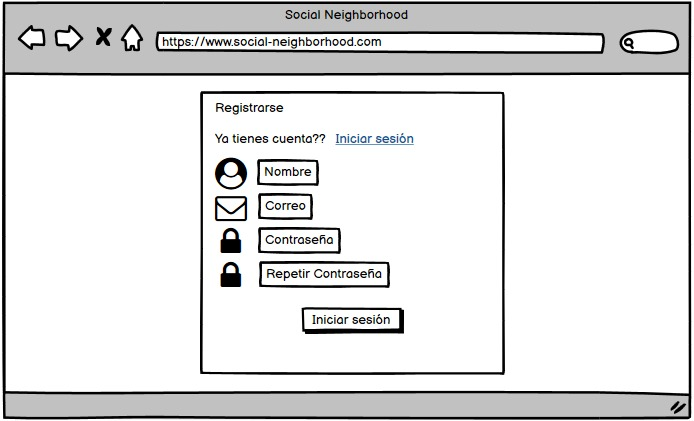
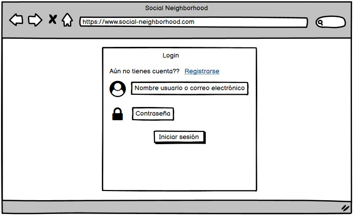
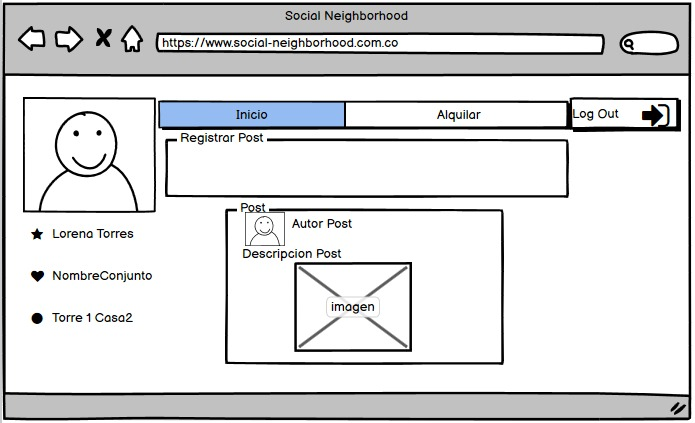

# Social Neighborhood

# Integrantes
  * [Ana Maria Salazar Bohorquez](https://github.com/anamariasalazar)
  * [Juan Camilo Posso Guevara](https://github.com/JCPosso)
  * [Richard Santiago Urrea Garcia](https://github.com/RichardUG)

# Resumen
> [Social neighborhood](https://github.com/social-neighborhood/social-neighborhood) es una solución informática la cual busca facilitar para los habitantes de los conjuntos residenciales tramites como pagos de servicios internos del conjunto, separación de espacios sociales, comunicación entre administrador-propietarios y propietarios-propietarios, brindándoles una herramienta optima y de fácil uso, con la cual se sientan cómodos y la puedan aprovechar al máximo.
> 
# Descripción
> El software [Social neighborhood](https://github.com/social-neighborhood/social-neighborhood) busca brindar un contacto más fácil entre administrador y residentes evitando problemas como falta de comunicación y posibilitando un acceso más fácil a información actual o pasada y a la vez una fácil gestión de pagos de los servicios que el conjunto presta (administración, parqueadero, gimnasio, etc.); sin embargo software de este tipo ya existen, por lo cual se opta por brindar un par de servicios más como es el caso de crear un canal de comunicación vía publicaciones (tipo post) en el cual los residentes puedan brindarse información entre ellos de una manera más general y fácil de propagar y por ultimo un espacio donde se pueda apartar las zonas sociales (piscina, salón comunal, cancha, sauna, etc.) quitando así el tiempo de espera que tienen los residentes para poder reunirse con la administración y además llevar un óptimo control del manejo y acceso de estas zonas por parte de la administración.
> 
> [Pesentación Social neighborhood](https://github.com/social-neighborhood/social-neighborhood/raw/main/social-neighborhood.pptx)

## [Back-end](https://github.com/social-neighborhood/social-neighborhood-back-end)

## [Front-end](https://github.com/social-neighborhood/social-neighborhood-front-end)

# Arquitectura y diseño

## Diagrama de casos de uso

## Diagrama de entidad-relación

## Diagrama de clases

## Diagrama de despliegue

## Diagrama C&C

# Prototipo

## Registro

## Login

## Posts

 

## Creación posts

# Manuales de usuario

## [Manual de usuario Social basico](https://github.com/social-neighborhood/social-neighborhood/raw/main/manuales/Manual%20de%20usuario%20Social%20basico.pdf)

## [Manual de usuario Social residentes](https://github.com/social-neighborhood/social-neighborhood/raw/main/manuales/Manual%20de%20usuario%20Social%20residentes.pdf)

## [Manual de usuario Social administradores](https://github.com/social-neighborhood/social-neighborhood/raw/main/manuales/Manual%20de%20usuario%20Social%20administradores.pdf)

# Requerimientos no funcionales

## [Laboratiorio en azure de disponibilidad de servicio back](https://github.com/social-neighborhood/social-neighborhood/raw/main/Requerimientos%20no%20funcionales/Explicacion%20disponibildad.mp4)

## [Muestra cambio Usabilidad minimalista, estetica y diseño](https://github.com/social-neighborhood/social-neighborhood/raw/main/Requerimientos%20no%20funcionales/Usabilidad.pptx)

# Enlace Taiga

# Enlace heroku

# Front-End

# Back-End

# Licencia & Derechos de Autor

**©** Ana Maria Salazar Bohorquez, Juan Camilo Posso Guevara, Richard Santiago Urrea Garcia. [Escuela Colombiana de Ingeniería Julio Garavito](https://www.escuelaing.edu.co/es/)  
Licencia bajo la [GNU General Public License](/LICENSE).

